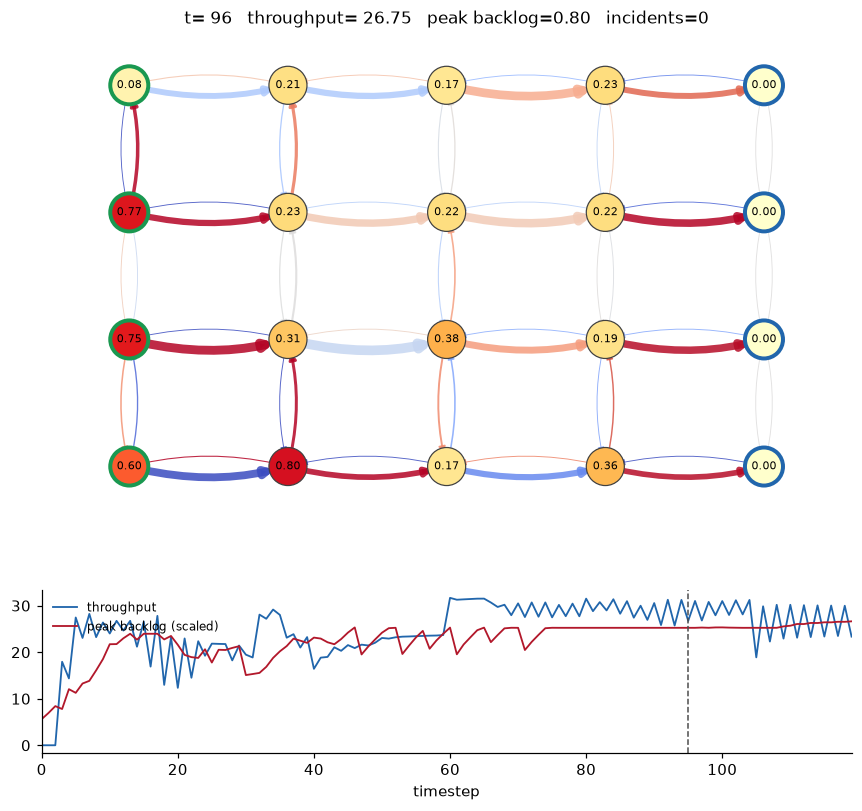
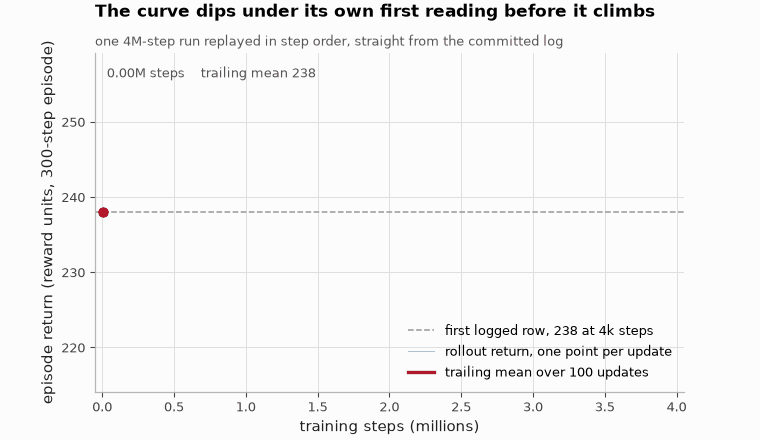

# Dynamic Graph Network Optimizer

**Can a GNN policy learn routing control that beats backpressure, and does it transfer to graphs it never saw?**

[](https://github.com/aghasalim/dynamic-graph-optimizer/actions/workflows/ci.yml)
[](LICENSE)



<sub>The trained agent mid-episode. Node colour is backlog, green borders are
sources and blue are sinks; edge width is flow and edge colour is the routing
offset.</sub>

---

## Abstract

Routing on a spatial network under time-varying demand and random link failure is
a control problem with a strong classical baseline: backpressure scheduling is
throughput-optimal for this class of queueing network, and minimising the drift of
a quadratic Lyapunov function reproduces it in closed form. This work asks whether
a graph neural network policy trained with PPO can beat it, and whether what it
learns is a property of the graph it trained on.

At 4M steps the agent beats backpressure on four of the five metrics I score,
0.929 served against 0.901, 0.047 dropped against 0.075, 0.602 mean peak backlog
against 0.672, while moving the routing weights roughly an order of magnitude
less. It loses the fifth: mean backlog over all nodes is 0.268 against 0.262. It
holds the worst node down and carries a little more queue everywhere else.
Trained on a 4x5 grid, it stays ahead on grids up to 8x10, four times the nodes
and 4.6 times the edges, with no retraining and no decay in the margin. That
transfer is the payoff of keeping the policy permutation-equivariant: 113 of 117
tensors copy across a change of topology, and the four that do not
are `edge_index` buffers and `log_std`.

Getting there took ten times the training budget I expected, and two plausible
fixes that both made things worse. Those are reported alongside the result.

**Contributions.** (i) A queueing simulator with spillback, incidents and
per-source rush-hour phases where the harm of a routing decision is measurable.
(ii) A reward whose congestion term is potential-based shaping, with the
telescoping property verified by test rather than asserted. (iii) An equivariant
policy head that replaces SB3's dense action layer, with the transfer experiment
that justifies it. (iv) Ablations showing which of the obvious fixes did not work.

---

## 1. Running it


```bash
pip install -e .
python tests/test_dgno.py
python -m dgno.train --timesteps 4000000
python -m dgno.visualize --policy backpressure --steps 150
```

## 2. Results

### 2.1 Against the baselines
10 eval episodes on shared seeds. `served` is delivered over offered demand, `peak_q` is the episode mean of the worst node's backlog, `churn` is how much the action moves per step.

The 4M agent serves 0.929 of offered demand against backpressure's 0.901,
drops 0.047 against 0.075, and holds the worst node at 0.602 against 0.672. Its churn is 0.0155 against backpressure's 0.1994, so it gets that while
moving the routing weights about an order of magnitude less. Mean backlog over
all nodes is the column it loses, 0.268 against 0.262.




*The 4M run replayed in step order. The dashed line is its own first reading
at 4k steps, and the curve spends a long stretch below it before climbing back
past.*


The two fixes I expected to work both failed. Raising the action head gain to
1.0 at 400k made it worse (0.877 served, 0.759 peak backlog against the 400k
baseline's 0.891 and 0.746), removing the churn penalty changed nothing to three decimals,
and an entropy bonus at 4M gave 0.902 served against the plain run's 0.929. What
fixed it was ten times the training budget.

Full detail in [notes/METHODS.md](notes/METHODS.md#21-against-the-baselines).
### 2.2 Transfer to other grid sizes
Trained on 4x5, evaluated with no retraining. `sp` is shortest-path, `bp` is backpressure.

On 8x10, four times the nodes and 4.6 times the edges of the training grid, it
still serves 0.898 against backpressure's 0.871 and keeps peak backlog at 0.706
against 0.751. The margin does not decay with size, though it is not flat
either: the widest served gap is +0.028 on the 4x5 grid it trained on, the
narrowest is +0.009 on 5x6, and it comes back to +0.027 on 8x10. Re-hosting the
policy on a new grid copies 113 of its 117 tensors, and the four that stay
behind are the `edge_index` buffers and `log_std`.


Full detail in [notes/METHODS.md](notes/METHODS.md#22-transfer-to-other-grid-sizes).
## 3. Reproducibility

The agent behind both tables is committed at `checkpoints/ppo-gnn-4m.zip` (1.1 MB),
so you don't have to spend the four hours retraining it:

```bash
python tests/test_checkpoint.py
```

That reloads it, re-runs the evaluation against both baselines, and fails if it
stops beating backpressure on throughput or peak backlog, or if it drifts back
towards a static policy. It runs in CI, so the numbers above are re-derived on
every push rather than being a table I typed once.

The ablation agents are committed too, under `checkpoints/ablations/`. Re-derive
every ablation number above in about 15 seconds:

```bash
python -m dgno.ablations
```

It scores every agent under the same reward and seeds, so `return` is comparable
across rows there -- unlike the per-run files in `docs/`, each of which uses the
reward its own agent was trained on.

Retraining from scratch, if you want to: `python -m dgno.train --timesteps 4000000`,
about four hours on 8 CPU envs.

## 4. Method
The congestion term is written as potential-based shaping, `gamma*Phi(s') - Phi(s)`, which is what makes it policy-invariant.

Policy-invariance has a price, and it shows up in the figure below. Because the
term telescopes, over a 300 step episode throughput accumulates 273.6 of return
while the shaping term sums to 0.69, a factor of about 400. It speeds up credit
assignment and applies almost no pressure of its own to flatten backlog. Routing
is a softmax over each node's out-edges, and at zero action that is plain
shortest-path, so the agent is correcting a working default rather than learning
to route from nothing.


Full detail in [notes/METHODS.md](notes/METHODS.md#4-method).
## 5. Repository layout

```
dgno/simulator.py   queueing dynamics, demand, incidents, spillback
dgno/env.py         Gymnasium wrapper, observations, reward
dgno/models.py      GATv2 encoder, SB3 extractor, policy
dgno/baselines.py   shortest-path, backpressure, evaluation
dgno/train.py       PPO config and entry point
dgno/transfer.py    re-host a trained policy on a different grid
dgno/ablations.py   re-derive the ablation table from the checkpoints
checkpoints/        the 4M agent and the six ablation agents
dgno/visualize.py   episode animation
dgno/figures.py     regenerate the figures in this README
tests/test_dgno.py  invariants, batching, shaping telescoping
tests/test_checkpoint.py  re-derives the reported numbers from the checkpoint
```

## 6. Limitations

Spillback rationing is single-pass, so a throttled node can leave its upstream
slightly over-served within the same tick. It corrects on the next one.

Flow is fluid rather than discrete vehicles, and the agent sees state with no
delay, which is where most of the real difficulty would be.

## References

The papers and sources this implementation follows. Each one is here because
the code uses the method, the dataset or the metric it describes.

- **Veličković, Cucurull, Casanova, Romero, Liò, Bengio. Graph Attention Networks. ICLR 2018.** [arXiv:1710.10903](https://arxiv.org/abs/1710.10903) the GAT state encoder.
- **Schulman, Wolski, Dhariwal, Radford, Klimov. Proximal Policy Optimization Algorithms. 2017.** [arXiv:1707.06347](https://arxiv.org/abs/1707.06347) the control policy.
- **Fey, Lenssen. Fast Graph Representation Learning with PyTorch Geometric. 2019.** [arXiv:1903.02428](https://arxiv.org/abs/1903.02428) the graph library.
- **Raffin, Hill, Gleave et al. Stable-Baselines3. JMLR 22, 2021.** the PPO implementation.
