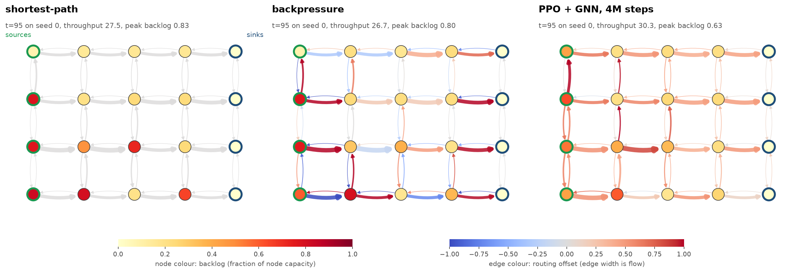
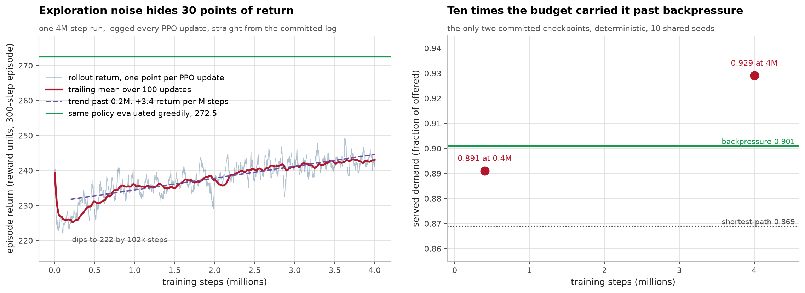
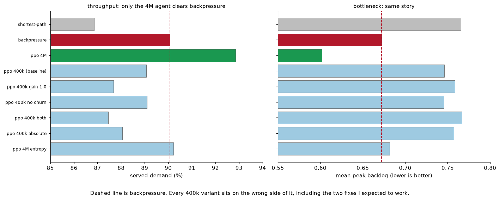
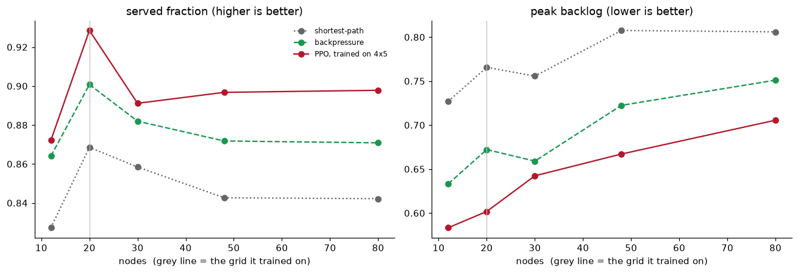
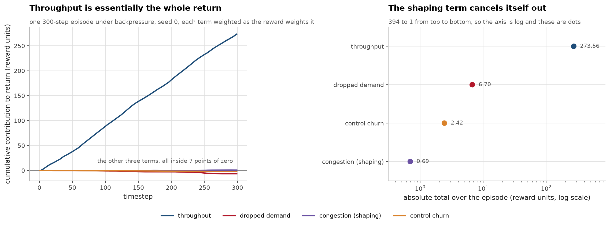

# Methods and detail

Long form detail moved out of the README.


### 2.1 Against the baselines


10 eval episodes on shared seeds.`served` is delivered over offered demand,
`peak_q` is the episode mean of the worst node's backlog,`churn` is how much the
action moves per step.

| policy | served | dropped | peak_q | mean_q | churn |
|---|---|---|---|---|---|
| shortest-path | 0.869 | 0.106 | 0.766 | 0.283 | 0.0000 |
| backpressure | 0.901 | 0.075 | 0.672 | **0.262** | 0.1994 |
| PPO + GNN, 400k steps | 0.891 | 0.083 | 0.746 | 0.285 | 0.0002 |
| PPO + GNN, 4M steps | **0.929** | **0.047** | **0.602** | 0.268 | 0.0155 |

`mean_q` is the episode mean backlog over all nodes, so it is the one column
backpressure keeps.



Same episode, same seed, same timestep. Shortest-path piles backlog onto a few
nodes and leaves most edges idle. Backpressure spreads it better, but its routing
offsets flip sign constantly, red and blue in the same picture, and that is the
churn. The agent pushes consistently in one direction and keeps every node in
roughly the same band.

At 4M steps it beats backpressure on served, dropped and peak backlog, and does
it with roughly an order of magnitude less control effort. That last part is the
bit I like: backpressure buys its throughput by thrashing the routing weights
every tick, and the agent gets a better result while barely moving them. The
exact churn ratio moves around with the episode sample (about 13x over 10
episodes, 9x over 5), so treat it as a magnitude rather than a figure.

It does not win every column. Mean backlog over all nodes is 0.268 against
backpressure's 0.262, so it loses that one by 0.006. Peak backlog is the column
it wins by the most, 0.602 against 0.672. Read together, the agent is holding the
worst node down and paying for it with slightly more queue on the rest.

Getting there took a lot more training than I expected. At 400k steps the agent
is basically static (churn 0.0002) and loses to backpressure. Two ablations at
400k, both of which I thought would fix it:

| | served | peak_q | churn |
|---|---|---|---|
| baseline | 0.891 | 0.746 | 0.0002 |
| action head gain 1.0 | 0.877 | 0.759 | 0.0069 |
| no churn penalty | 0.891 | 0.746 | 0.0002 |
| both | 0.875 | 0.767 | 0.0064 |

Raising the action head off its 0.01 init made things worse. Removing the churn
penalty landed within 0.0006 served of the baseline, which is below the precision
of this table -- a different reward does give a different agent, it just converges
to the same behaviour. Neither was the problem, it just
needed roughly 10x the steps. An entropy bonus of 0.01 at 4M also hurt (0.902
served, 0.682 peak_q), so keeping exploration alive isn't what did it either.



I misread this curve at first and want to leave the mistake in. I sampled eight
evenly spaced points from the log and read them as flat, so I concluded that 4M
steps had bought nothing and that I was up against a reward ceiling. Plotting the
whole thing shows a steady rise instead: bucket means go 226, 229, 235, 236, 240,
242, a trend of +3.4 return per million steps. What tricked me is the very first
logged row, at 4k steps before the policy had learned anything, which happened to
be a transient spike of 238. Against that, "242 at 2.6M" looks like no progress.
The curve actually dips to 222 by 100k and climbs from there.

The real gap in that plot is vertical, not horizontal. Rollout reward tops out
around 243 while the same policy evaluated greedily returns 272.5, because
rollouts are collected under a Gaussian with std ~0.35 and the exploration noise
costs about 30 points of return. So the training curve understates the policy by
a wide margin, which is worth knowing before you compare it to a baseline number.

The difference shows up directly in the actions. The 400k policy only spans
[-0.278, 0.122] of its available [-1, 1] and moves 0.057 when I slam every queue
to 95% full. The 4M policy uses the full range and moves 0.142.



Every 400k variant sits on the wrong side of the backpressure line, including both
fixes I expected to work. Raising the action-head gain made it worse; removing the
churn penalty changed nothing to three decimals. The only thing that moved it was
ten times the budget.


### 2.2 Transfer to other grid sizes


Trained on 4x5, evaluated with no retraining.`sp` is shortest-path,`bp` is
backpressure.

| grid | nodes | edges | served sp / bp / ppo | peak_q sp / bp / ppo |
|---|---|---|---|---|
| 3x4 | 12 | 34 | 0.827 / 0.864 / **0.872** | 0.727 / 0.633 / **0.583** |
| 4x5 | 20 | 62 | 0.869 / 0.901 / **0.929** | 0.766 / 0.672 / **0.602** |
| 5x6 | 30 | 98 | 0.858 / 0.882 / **0.891** | 0.756 / 0.659 / **0.642** |
| 6x8 | 48 | 164 | 0.843 / 0.872 / **0.897** | 0.808 / 0.722 / **0.667** |
| 8x10 | 80 | 284 | 0.842 / 0.871 / **0.898** | 0.806 / 0.751 / **0.706** |

It still beats backpressure on a grid with four times the nodes and 4.6 times the
edges. The plot does show a home-field bump: the biggest margin, +0.028 served,
is on 4x5, the grid it trained on, and 5x6 is the weakest at +0.009. But it
recovers to +0.025 and +0.027 on the two largest grids, so the advantage is not
decaying with scale, it just isn't perfectly flat either. This is the thing the
equivariant action head was for, nothing in the policy is tied to graph size
except the`edge_index` buffer and`log_std`, so rebuilding the policy for a new
topology and copying the weights transfers the control rule intact. 113 of 117
tensors copy; the four that don't are the three`edge_index` buffers and
`log_std`, which is unused in deterministic evaluation.



```bash
python -m dgno.transfer --grids 3x4,4x5,5x6,6x8,8x10
```

Raw output in`docs/evaluation-*.txt`, curves in`docs/curve-*.csv`, transfer
table in`docs/transfer.txt`.


## 4. Method




The congestion term is written as potential-based shaping,`gamma*Phi(s') - Phi(s)`,
which is what makes it policy-invariant. The same property is why it contributes
almost nothing to episode return: over 300 steps throughput accumulates 273.6 while
the shaping term telescopes to 0.69, a factor of 400. That is the mechanism behind
the`peak_q` result at 400k, and it is a property of the theorem rather than a bug
but it does mean shaping alone will not buy a bottleneck objective.

A 4-connected grid, demand injected on the left column and absorbed on the right.
Each source has its own rush-hour phase so surges hit different corners at
different times, and roads randomly lose 85% of capacity for a while. When a node
fills up it pushes back on its upstream neighbours, one hop per tick, which is
what makes congestion actually spread.

Routing is a softmax over each node's out-edges. At zero action it's plain
shortest-path, so the agent is correcting a working default rather than learning
routing from nothing.

The reward is throughput, minus dropped demand, minus a congestion term, minus a
penalty on moving the action too much:

```
r = w_T * throughput - w_D * dropped
    - w_B * (gamma * Phi(u') - Phi(u))
    - w_S * ||a_t - a_{t-1}||^2
```

`Phi` is a log-sum-exp over normalised queues, which is a smooth stand-in for
"how bad is the worst node". Writing the congestion term as a difference makes it
potential-based shaping, so it can't change the optimal policy, only how fast you
find it. There's a catch I hit: because it telescopes it also contributes almost
nothing to episode return, so it gives no real pressure to flatten backlog.
`--bottleneck-mode absolute` drops the telescoping and does move the optimum, but
scored worse in practice. Despite that,`peak_q` still came down a long way once
the agent trained properly, so throughput and bottleneck relief were less at odds
here than I assumed.

The GNN is a residual GATv2 stack with edge features. Three layers, because
congestion spreads one hop per tick and that makes depth a physical quantity
rather than a taste one. One detail worth knowing if you read`models.py`: SB3
would normally put a dense`Linear(latent, num_edges)` on the policy output,
which throws away the permutation symmetry the GNN is there for, so I replace it
with a weight-shared per-edge head.

Longer write-up of the reward and the GNN choices: [docs/design-notes.md](docs/design-notes.md).
